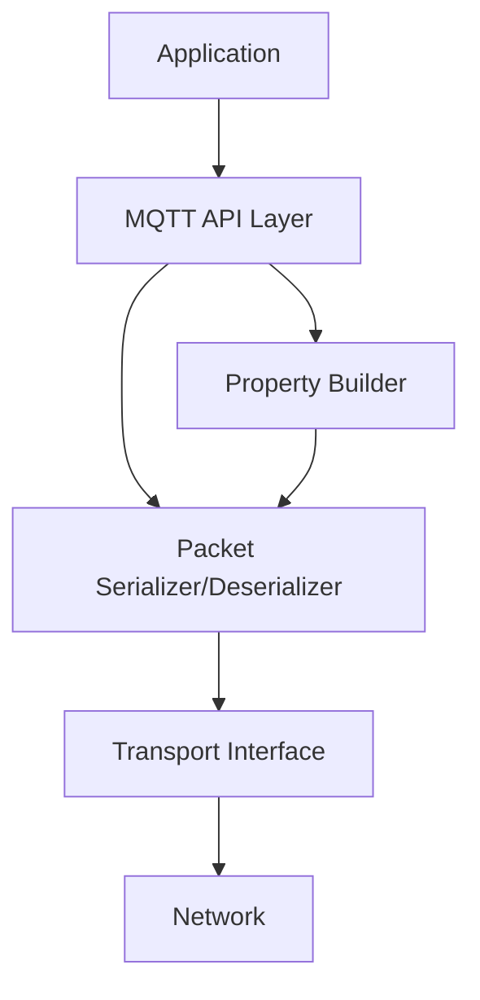

# Design Document: MQTT v5.0 Features for coreMQTT

## Overview

This design document outlines the approach for implementing MQTT v5.0 features in the coreMQTT library. The implementation will extend the existing MQTT v3.1.1 functionality while maintaining backward compatibility. The design focuses on adding support for MQTT v5.0 properties, reason codes, and the new AUTH packet type.

The implementation will follow a property builder pattern for constructing MQTT v5.0 packets with properties, allowing developers to selectively add properties to packets. This approach provides a clean API that is type-safe and memory-efficient.

## Architecture

The architecture for the MQTT v5.0 implementation builds upon the existing coreMQTT library architecture. The key components are:

1. **Core MQTT Context**: Extended to support MQTT v5.0 features
2. **Property Builder**: A new component for constructing MQTT v5.0 properties
3. **Packet Serializer/Deserializer**: Enhanced to handle MQTT v5.0 packet formats
4. **Event Callback System**: Extended to provide MQTT v5.0 specific information

### High-Level Architecture Diagram



## Components and Interfaces

### MQTT Context Extension

The MQTT context will be extended to support MQTT v5.0 features:

```c
typedef struct MQTTContext
{
    // Existing MQTT v3.1.1 fields...
    
    // New fields for MQTT v5.0
    MQTTFixedBuffer_t* pAckPropsBuffer;  // Buffer for ACK properties
    uint8_t mqttVersion;                 // MQTT protocol version (3 or 5)
    // Other MQTT v5.0 specific fields...
} MQTTContext_t;
```

### Property Builder

The property builder is a new component that allows applications to construct MQTT v5.0 properties:

```c
typedef struct MqttPropBuilder {
    uint8_t* pBuffer;       // Pointer to user-provided buffer
    size_t bufferLength;    // Length of the buffer
    size_t currentIndex;    // Current write position in the buffer
    uint32_t fieldsSet;     // Bitmask of fields that have been set
} MqttPropBuilder_t;
```

The property builder will be initialized with a user-provided buffer:

```c
MQTTStatus_t MqttPropertyBuilder_Init(MqttPropBuilder_t* pPropBuilder,
                                     uint8_t* pBuffer,
                                     size_t bufferLength);
```

### Property Addition APIs

For each MQTT v5.0 property, there will be a corresponding API to add it to the property builder:

#### Connect Properties

```c
MQTTStatus_t MQTTPropAdd_ConnSessionExpiry(MqttPropBuilder_t* pPropBuilder,
                                          uint32_t sessionExpiry);

MQTTStatus_t MQTTPropAdd_ConnReceiveMax(MqttPropBuilder_t* pPropBuilder,
                                       uint16_t receiveMaximum);

MQTTStatus_t MQTTPropAdd_ConnMaxPacketSize(MqttPropBuilder_t* pPropBuilder,
                                          uint32_t maxPacketSize);

MQTTStatus_t MQTTPropAdd_ConnTopicAliasMax(MqttPropBuilder_t* pPropBuilder,
                                          uint16_t topicAliasMaximum);

MQTTStatus_t MQTTPropAdd_ConnRequestRespInfo(MqttPropBuilder_t* pPropBuilder,
                                            bool requestResponseInfo);

MQTTStatus_t MQTTPropAdd_ConnRequestProbInfo(MqttPropBuilder_t* pPropBuilder,
                                            bool requestProblemInfo);

MQTTStatus_t MQTTPropAdd_ConnUserProps(MqttPropBuilder_t* pPropBuilder,
                                      MQTTUserProperty* userPropArray,
                                      size_t userPropArrayLen);

MQTTStatus_t MQTTPropAdd_ConnAuthMethod(MqttPropBuilder_t* pPropBuilder,
                                       uint8_t* authMethod,
                                       size_t authMethodLength);

MQTTStatus_t MQTTPropAdd_ConnAuthData(MqttPropBuilder_t* pPropBuilder,
                                     uint8_t* authData,
                                     size_t authDataLength);
```

#### Publish Properties

```c
MQTTStatus_t MQTTPropAdd_PubPayloadFormat(MqttPropBuilder_t* pPropBuilder,
                                         bool payloadFormat);

MQTTStatus_t MQTTPropAdd_PubMessageExpiry(MqttPropBuilder_t* pPropBuilder,
                                         uint32_t messageExpiryInterval);

MQTTStatus_t MQTTPropAdd_PubTopicAlias(MqttPropBuilder_t* pPropBuilder,
                                      uint16_t topicAlias);

MQTTStatus_t MQTTPropAdd_PubResponseTopic(MqttPropBuilder_t* pPropBuilder,
                                         char* responseTopic,
                                         size_t responseTopicLength);

MQTTStatus_t MQTTPropAdd_PubCorrelationData(MqttPropBuilder_t* pPropBuilder,
                                           uint8_t* correlationData,
                                           size_t correlationDataLength);

MQTTStatus_t MQTTPropAdd_PubUserProps(MqttPropBuilder_t* pPropBuilder,
                                     MQTTUserProperty* userPropArray,
                                     size_t userPropArrayLen);

MQTTStatus_t MQTTPropAdd_PubContentType(MqttPropBuilder_t* pPropBuilder,
                                       char* contentType,
                                       size_t contentTypeLength);
```

#### ACK Properties

```c
MQTTStatus_t MQTTPropAdd_PubAckReasonString(MQTTContext_t* pContext,
                                           uint8_t* pBuffer,
                                           size_t bufferLen);

MQTTStatus_t MQTTPropAdd_PubAckUserProperty(MQTTContext_t* pContext,
                                           MQTTUserProperty* userPropArray,
                                           size_t userPropArrayLen);
```

### Extended API Functions

The existing API functions will be extended to support MQTT v5.0 features:

#### MQTT_Init

```c
MQTTStatus_t MQTT_Init(MQTTContext_t* pContext,
                      const TransportInterface_t* pTransportInterface,
                      MQTTGetCurrentTimeFunc_t getTimeFunction,
                      MQTTEventCallback_t userCallback,
                      const MQTTFixedBuffer_t* pNetworkBuffer,
                      const MQTTFixedBuffer_t* pAckPropsBuffer);
```

#### MQTT_Connect

```c
MQTTStatus_t MQTT_Connect(MQTTContext_t* pContext,
                         const MQTTConnectInfo_t* pConnectInfo,
                         const MQTTPublishInfo_t* pWillInfo,
                         uint32_t timeoutMs,
                         bool* pSessionPresent,
                         MqttPropBuilder_t* pPropertyBuilder);
```

#### MQTT_Publish

```c
MQTTStatus_t MQTT_Publish(MQTTContext_t* pContext,
                         const MQTTPublishInfo_t* pPublishInfo,
                         uint16_t packetId,
                         MqttPropBuilder_t* pPropertyBuilder);
```

### User Property Structure

```c
typedef struct MQTTUserProperty {
    uint8_t* key;
    size_t keyLength;
    uint8_t* value;
    size_t valueLength;
} MQTTUserProperty;
```

### ACK Properties Structure

```c
typedef struct MQTTAckProperties_t {
    uint8_t* pReasonString;
    size_t reasonStringLength;
    MQTTUserProperty* pMqttUserPropertyArray;
    size_t mqttUserPropertyArrayLength;
    uint8_t* pSubUnsubAckReasonCodes;
    size_t subAckUnsubReasonCodesLength;
} MQTTAckProperties;
```

### Extended Event Callback

```c
typedef void (*MQTTEventCallback_t)(struct MQTTContext* pContext,
                                   struct MQTTPacketInfo* pPacketInfo,
                                   struct MQTTDeserializedInfo* pDeserializedInfo,
                                   struct MQTTAckProperties* pMqttAckProperties);
```

### Incoming Publish Property Iterator

```c
bool MQTT_IncomingPubGetNextProp(struct MQTTContext* pContext,
                                uint8_t** pCurrIndex,
                                uint8_t** pUserPropKey,
                                size_t* pUserPropKeyLen,
                                uint8_t** pUserPropVal,
                                size_t* pUserPropValLen);
```

## Data Models

### MQTT v5.0 Property Identifiers

```c
/* Connect packet properties */
#define CONNECT_SESSION_EXPIRY_INTERVAL 0x11
#define CONNECT_RECEIVE_MAXIMUM 0x21
#define CONNECT_MAXIMUM_PACKET_SIZE 0x27
#define CONNECT_TOPIC_ALIAS_MAXIMUM 0x22
#define CONNECT_REQUEST_RESPONSE_INFO 0x19
#define CONNECT_REQUEST_PROBLEM_INFO 0x17
#define CONNECT_USER_PROPERTY 0x26
#define CONNECT_AUTH_METHOD 0x15
#define CONNECT_AUTH_DATA 0x16

/* Publish packet properties */
#define PUBLISH_PAYLOAD_FORMAT_INDICATOR 0x01
#define PUBLISH_MESSAGE_EXPIRY_INTERVAL 0x02
#define PUBLISH_TOPIC_ALIAS 0x23
#define PUBLISH_RESPONSE_TOPIC 0x08
#define PUBLISH_CORRELATION_DATA 0x09
#define PUBLISH_USER_PROPERTY 0x26
#define PUBLISH_CONTENT_TYPE 0x03

/* ACK packet properties */
#define PUBACK_REASON_STRING 0x1F
#define PUBACK_USER_PROPERTY 0x26
/* ... other ACK properties ... */
```

### MQTT v5.0 Reason Codes

```c
/* Success reason codes */
#define MQTT_REASON_SUCCESS 0x00
#define MQTT_REASON_NORMAL_DISCONNECTION 0x00
#define MQTT_REASON_GRANTED_QOS_0 0x00
#define MQTT_REASON_GRANTED_QOS_1 0x01
#define MQTT_REASON_GRANTED_QOS_2 0x02

/* Error reason codes */
#define MQTT_REASON_UNSPECIFIED_ERROR 0x80
#define MQTT_REASON_MALFORMED_PACKET 0x81
#define MQTT_REASON_PROTOCOL_ERROR 0x82
#define MQTT_REASON_IMPLEMENTATION_SPECIFIC_ERROR 0x83
/* ... other reason codes ... */
```

## Error Handling

The implementation will use the existing `MQTTStatus_t` enum for error handling, with additional error codes for MQTT v5.0 specific errors:

```c
typedef enum MQTTStatus
{
    /* Existing error codes... */
    
    /* New error codes for MQTT v5.0 */
    MQTTServerRefused,           /* Server refused the request with a reason code */
    MQTTPropertyRejected,        /* Property was rejected by the server */
    MQTTAuthenticationFailed,    /* Authentication failed */
    MQTTTopicAliasInvalid,       /* Topic alias is invalid */
    /* ... other error codes ... */
} MQTTStatus_t;
```

## Testing Strategy

The testing strategy for the MQTT v5.0 implementation will include:

1. **Unit Tests**: Test each new API function and component in isolation
2. **Integration Tests**: Test the interaction between components
3. **System Tests**: Test the complete MQTT v5.0 implementation against a real MQTT v5.0 broker
4. **Compatibility Tests**: Ensure backward compatibility with MQTT v3.1.1
5. **Performance Tests**: Measure the performance impact of the MQTT v5.0 implementation

### Unit Test Cases

1. Test property builder initialization
2. Test adding each type of property to the property builder
3. Test property builder error handling (buffer overflow, duplicate properties)
4. Test serialization and deserialization of MQTT v5.0 packets
5. Test parsing of reason codes and properties in ACK packets
6. Test iterating through user properties in incoming publish packets
7. Test adding properties to ACK packets

### Integration Test Cases

1. Test connecting with MQTT v5.0 properties
2. Test publishing with MQTT v5.0 properties
3. Test subscribing with MQTT v5.0 subscription options
4. Test handling of server-initiated disconnect with reason code
5. Test enhanced authentication flow

### System Test Cases

1. Test against Mosquitto MQTT v5.0 broker
2. Test against HiveMQ MQTT v5.0 broker
3. Test against AWS IoT Core (when MQTT v5.0 support is available)

## Implementation Considerations

### Memory Management

The property builder pattern uses user-provided buffers to avoid dynamic memory allocation. This approach is consistent with the existing coreMQTT library design and is suitable for embedded systems with limited resources.

### Backward Compatibility

The implementation will maintain backward compatibility with MQTT v3.1.1 by:

1. Making all MQTT v5.0 features optional
2. Defaulting to MQTT v3.1.1 behavior when MQTT v5.0 features are not used
3. Providing clear documentation on how to use MQTT v5.0 features

### Performance

The implementation will minimize the performance impact of MQTT v5.0 features by:

1. Using efficient serialization and deserialization algorithms
2. Avoiding unnecessary memory copies
3. Optimizing the property builder for embedded systems

## Conclusion

This design provides a comprehensive approach to implementing MQTT v5.0 features in the coreMQTT library. The property builder pattern offers a clean and type-safe API for constructing MQTT v5.0 packets with properties, while maintaining backward compatibility with MQTT v3.1.1. The implementation will focus on the key MQTT v5.0 features that provide the most value to developers, such as improved error reporting, message expiry, and enhanced authentication.